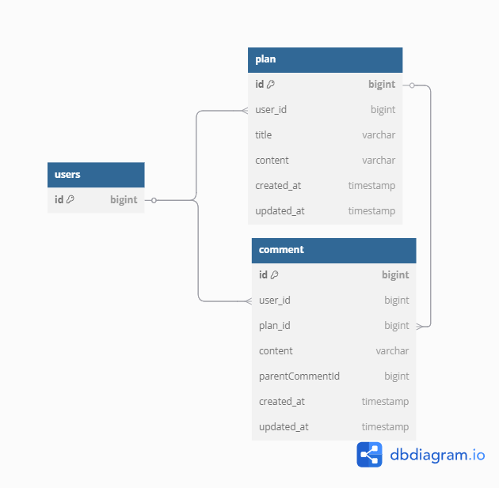

# 프로젝트 개요
- 댓글 CRUD 및 대댓글 CRUD 구현

- 프로젝트 기간 : 2025-04-30 ~ 2025-05-14

---
# 개발환경
- jdk : 17.0.1
- Framework : Spring Boot 3.4.5
- Build Tool : Gradle
- IDE : IntelliJ
---

# ERD

---
# API 명세서

---
# 구현 기능

## 0. 공통 부문

- GlobalExceptionHandler를 통해 예외처리를 하였습니다
- JPA Auditing을 활용하기 위해 BaseEntity를 설정하고 생성일과 수정일을 필드로 설정하였습니다
- 로그인 기능 구현을 위해 filter 및 session을 적용하였습니다

## 1. 유저 부문

- 프로젝트 요구 사항에 따라 유저 부문은 최소화 하였으며 filter 및 session 연습을 위해 그 부분만 구현하였습니다 
- 회원가입 기능 구현
- 로그인 기능 구현

## 2. 일정 부문

- 일정 생성 기능 구현
- 전체 일정 조회 기능 구현
  - Pageable을 적용하여 페이징 하였습니다
- 단일 일정 조회 기능 구현
  - 댓글도 함께 조회하도록 구현하였습니다
- 일정 수정 기능 구현
- 일정 삭제 기능 구현

## 3. 댓글 부문

 - 댓글 생성 기능 구현
 - 댓글 조회 기능 구현
 - 댓글 수정 기능 구현
 - 댓글 삭제 기능 구현
   - 대댓글 조회 시 NPE 방지를 위해 soft delete 형식으로 구현하였습니다

## 4. 대댓글 부문

- 대댓글의 경우 요구사항에는 연관관계를 맺으라고 하였지만 튜터님과 상담 하에 연관관계 없이 진행하였습니다
- 대댓글의 경우 댓글과 같은 Entity를 공유하기 때문에 API도 공유하여 사용하였습니다  
- 대댓글 생성 기능 구현
  - 대댓글 생성 시에 필요한 parentCommentId는 dto를 통해 body로 받아오도록 구현하였습니다
- 대댓글 조회 기능 구현
  - 댓글과 트리 형식으로 출력이 가능하도록 하기 위해 Map을 활용하였습니다
- 대댓글 수정 기능 구현
- 대댓글 삭제 기능 구현

---
# 트러블 슈팅
- 관련 내용은 블로그를 참고해주시기 바랍니다
  - https://couchpo.tistory.com/